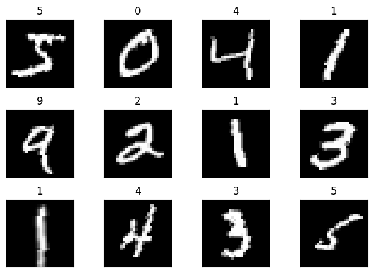

# Session 5 Assignment
# MNIST classification

## Problem statement

The goal here is to take session 4's solution and refactor it into files namely: `model.py`, `utils.py`, and `S5.ipynb`. 
S5.ipynb is the notebook with themain execution while teh other two Python files are helper files

Sample from the dataset




## Files

## 1. model.py

This defines the architecture of the neural network used for classification. The `Net` class is a subclass of `torch.nn.Module` which consists of convolutional and fully connected layers. The `forward` method runs the forward pass of the model based on the architeecture defined in the `Net` class, and the `summary` method provides a detailed summary of the model's architecture.

```
============================================================================================================================================
Layer (type:depth-idx)                   Input Shape               Output Shape              Param #                   Param %
============================================================================================================================================
Net                                      [1, 28, 28]               [1, 10]                   --                             --
├─Conv2d: 1-1                            [1, 28, 28]               [32, 26, 26]              320                         0.05%
├─Conv2d: 1-2                            [32, 26, 26]              [64, 24, 24]              18,496                      3.12%
├─Conv2d: 1-3                            [64, 12, 12]              [128, 10, 10]             73,856                     12.45%
├─Conv2d: 1-4                            [128, 10, 10]             [256, 8, 8]               295,168                    49.76%
├─Linear: 1-5                            [1, 4096]                 [1, 50]                   204,850                    34.53%
├─Linear: 1-6                            [1, 50]                   [1, 10]                   510                         0.09%
============================================================================================================================================
Total params: 593,200
Trainable params: 593,200
Non-trainable params: 0
Total mult-adds (Units.MEGABYTES): 727.92
============================================================================================================================================
Input size (MB): 0.00
Forward/backward pass size (MB): 0.70
Params size (MB): 2.37
Estimated Total Size (MB): 3.08
============================================================================================================================================
```

## 2. utils.py

The `utils.py` file is a helper file to the ipy notebook and it has functions used in the project. It includes functions for training the model, testing the model's performance, plotting model performance and training stats.

## 3. S5.ipynb

The `S5.ipynb` file is the master file that runs image classification. 
All the cells in `S5.ipynb` can be executed to train and test the model. Hyperparameters such as learning rate, momentum, batch size, and number of epochs can be varied to improve the training results.