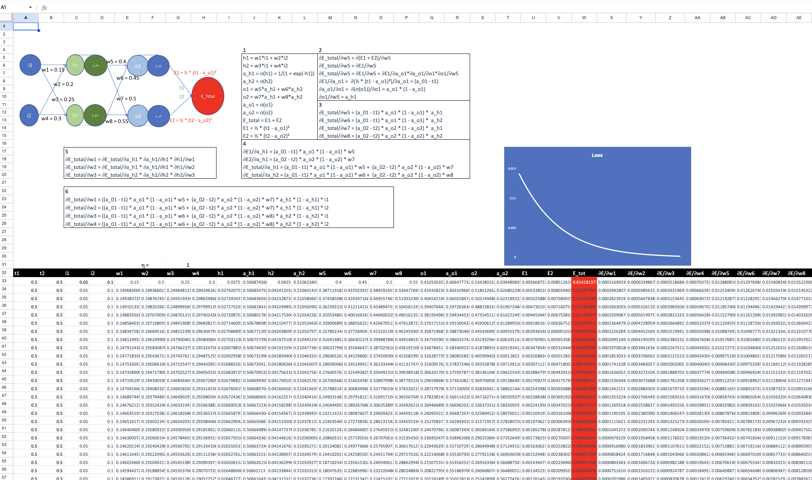
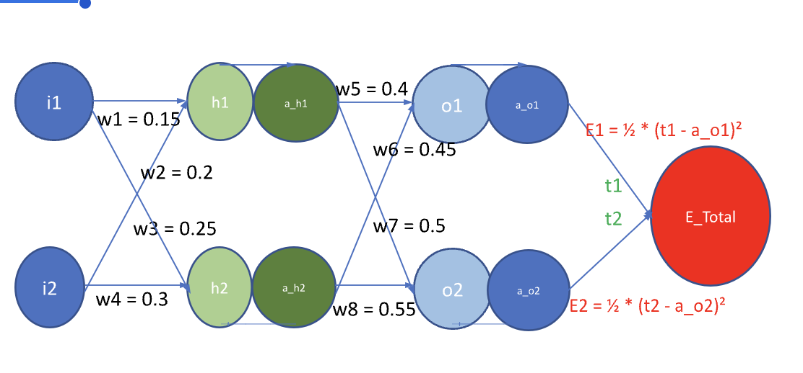
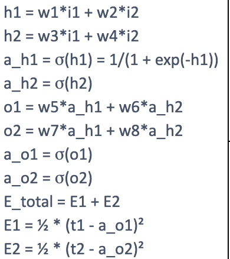
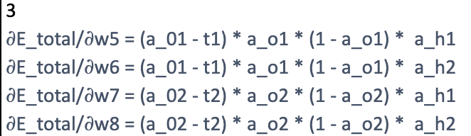
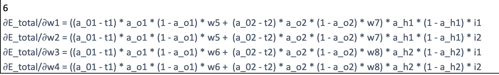
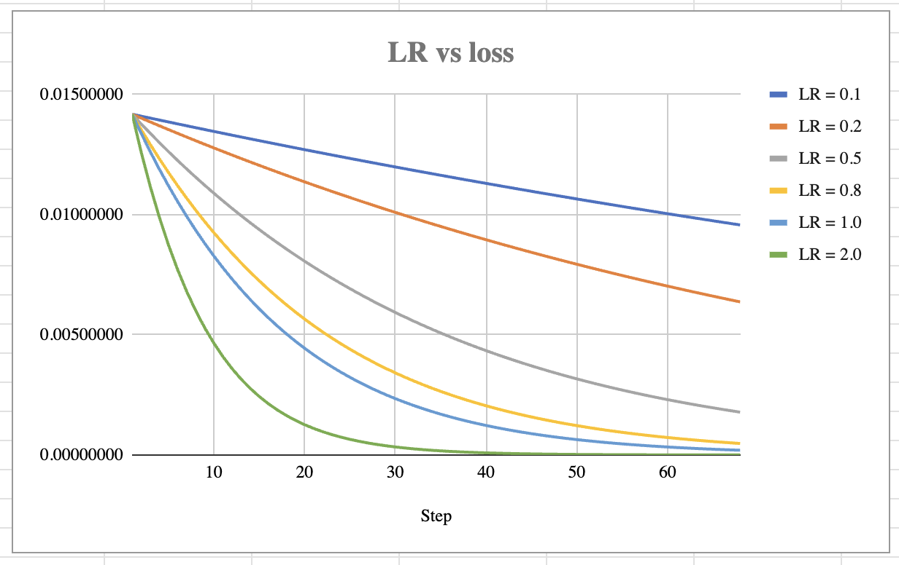

# Part 1

## Backpropagation

Backpropagation is the process where the weights in a neural network are updated after a complete forward pass. A forward pass of a neural network computes the loss and the network updates the weights based on the loss.

### Given neural network

## Steps

### 1. Forward propagation

The above network has 2 inputs(i1, i2) and 2 outputs(o1, o2). There is one hidden layer with size 2 which takes in direct inputs from inputs u1 and i2. The hidden layer receives a weighted sum of the input and then applied sigmoid to the sum. The input for the hidden layer is then passed on to the output layer. The output layer takes in weighted inputs from the input layer, applies sigmoid and gives the final output.

### 2. Backward propagation

In backward propagation(backprop), the gradients of the weights w.r.t the loss functino are computed. Using gradient descent, the weights are updated beginning from the output layer. Depending on the gradient and the learning rate, the weights and biases, if added, will be updated in each layer. The calculation involves calculating the partial derivatives of the weights wrt the loss function in each layer. Using chain rule, the weights are calculated to previous layers which enables us to update the weights. This process is repeated for a set number of epochs or till the assumed global minima is obtained. 

## Learning rates

### Problem 

Vary learning rate to 0.1, 0.2, 0.5, 0.8, 1.0, 2.0

### Observation

Increasing the learning rate increates the rate at which convergence happens.